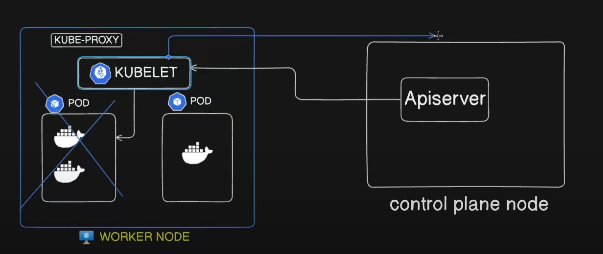

### Architecture Of Kubernetes


***


``` bash

On the left the control plane or a master node 

On the right side they are worker node 

node is a VM , we run our components , work loads , administrative components  

Control plane or a master node is a VM or a node that host many adminstrative componenets with own purpise to run our cluster smoothly 

```

### Why Kubernetes ?

``` bash
To host our application containers those containers run in the worker nodes , who  instructing the working nodes to work? thatis control plane with the help of different components 

```

### Pods 


``` bash
A Pod is the smallest deployable unit in Kubernetes.

Pods are used to run one or more containers inside Kubernetes.

Kubernetes cannot run containers directly – it always wraps them inside a Pod.

All containers in a Pod share:

The same IP address & network

Storage volumes (if mounted)

The same lifecycle (start, stop, restart together)

Pods make it easier to:

Schedule workloads on nodes

Scale applications (by creating multiple Pods)

Manage app lifecycles in a standard way

Analogy:

Container = baby 👶

Pod = crib/room 🛏️ (safely holds the baby)

Node = house 🏠 (where rooms exist)

Cluster = city 🌆 (all houses together)

👉 In short: We use Pods because they give containers a consistent, manageable environment inside Kubernetes.

own example : Multuiple contaienrs share he resources between them inside a Pod
```

***
``` json
{
  "WorkerNode": "Container running",
  "ControlPlane": [
    "API Server",
    "Other control plane components"
  ]
}
```
***

### Control Plane Components


``` bash

🟦 API Server

Acts as the central control plane component in Kubernetes.

All incoming requests from users, kubectl, or other components first reach the API server.

It validates the request, authenticates/authorizes it, and then communicates with other components like etcd, scheduler, controller manager, kubelet.

Real-World Example:

Think of the API server as the "front desk" in a hospital.
Every patient (request) first checks in here before being directed to the right department (scheduler, controller, etc.).

```
<br>

``` bash 
🟩 Scheduler

Responsible for assigning newly created Pods to Nodes in the cluster.

It receives the Pod creation request from the API server and decides on which Node the Pod should run.

The decision is based on factors like:

Available CPU/memory (resource requests and limits).

Node affinity/taints/tolerations.

Workload distribution (spreading across nodes).

Real-World Example:

Imagine a school principal assigning new students (pods) to different classrooms (nodes)
based on available seats, subject requirements, and teacher capacity.
```

<br>

``` bash
🟨 Controller Manager

Runs various controllers in the background to ensure the desired state of the cluster is maintained.

Important controllers include:

Node Controller → Monitors the health of nodes and reacts if a node goes down.

Namespace Controller → Manages creation and deletion of namespaces.

Deployment Controller → Ensures the desired number of pod replicas are always running.

Real-World Example:

Think of the Controller Manager as a city manager with multiple departments (health, transport, electricity).
If a streetlight goes out (pod fails), the electricity department (deployment controller) fixes it.

```
<br>


``` bash

🟧 etcd

Definition:
etcd is a distributed key-value data store used by Kubernetes to store all cluster data.

Characteristics:

Unlike RDBMS (rows and columns), etcd is a NoSQL database.

Stores data in simple key:value pairs (often in JSON format).

Maintains the state of the cluster — nodes, pods, secrets, ConfigMaps, and network policies.

Any change in the cluster (e.g., deploying a new pod) is first processed by the API Server, and then etcd is updated instantly.

etcd can only be accessed by the API Server — users and other components do not talk to etcd directly.

Real-World Example:

Think of etcd as a central registry or logbook in a company’s head office.

The front desk (API Server) is the only one who writes or reads from it.

If a new employee joins (new pod), the front desk updates the logbook (etcd).

If someone wants to know how many employees are present (current cluster state), they ask the front desk (API Server), not the logbook directly.
```

### Kube proxy 


``` bash 
🟦 kubectl

Definition:

kubectl is the command-line tool used by administrators and developers to interact with the Kubernetes cluster.

All the commands you type (kubectl get pods, kubectl delete pod, etc.) are sent as requests to the API Server.
```


- let us see how its work 


``` bash

🔄 What Happens When You Run kubectl delete pod my-pod

kubectl → API Server → Sends delete request.

API Server → Authenticates & authorizes, then updates etcd (desired state = pod removed).

Controller Manager → Notices pod still running, triggers deletion.

Kubelet → Stops the pod’s containers on its node.

Kube-Proxy → Removes pod from service endpoints.

Final State → etcd shows pod is gone, cluster state is consistent.


Own : The request is comming to the  API serever to delete a pod, now the API server authenticate and authorize the request and then implement in action like this and also the changes made in the ETDC also 
```


***

### Kube Proxy


<br>

<br>

<br>

``` bash
🔄 What Happens When You Run kubectl apply -f pod.yaml

External Client (kubectl)

User runs kubectl apply -f pod.yaml.

The request is sent to the API Server.

API Server

Authenticates & authorizes the request.

Validates the YAML (image, ports, etc.).

Updates etcd with the desired state → “a new pod should exist.”

(Note: etcd does not create the pod, it just stores the state).

Scheduler

Detects an unscheduled pod in etcd.

Decides which Node to place it on (based on resources, affinity, etc.).

Informs the API Server of the scheduling decision.

Kubelet (on target Node)

API Server tells the kubelet to create the pod.

Kubelet pulls the container image and starts the pod.

Kube-Proxy

Updates networking rules so the pod can communicate with other services.

Final Response

API Server updates etcd with the new state (pod running).

Returns a success response back to the user through kubectl.
```
when we run

``` bash
kubectl get pods
```
- kubectl → API Server → API Server queries etcd → returns the list of pods.
- ⚡ So yes, etcd makes it easy to find the number of pods, nodes, or any cluster object without manually checking inside the cluster.
