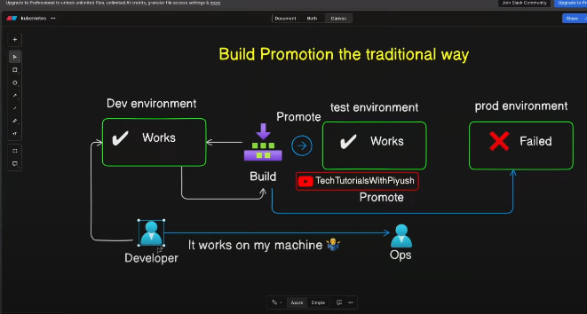
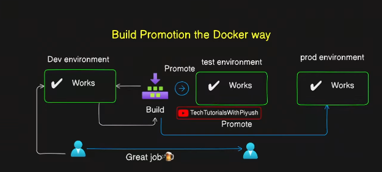
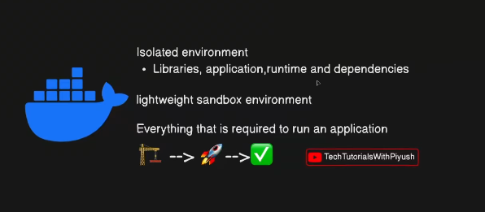
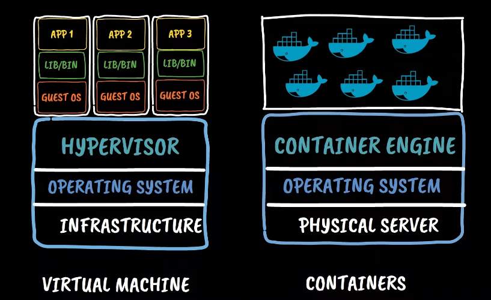
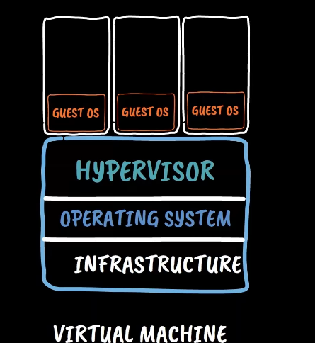
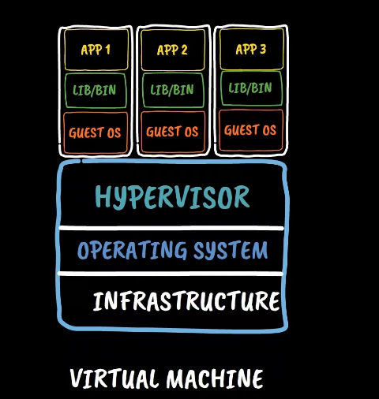
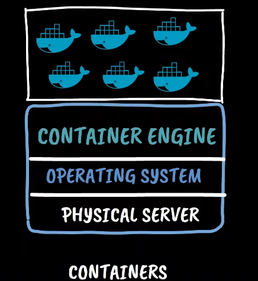
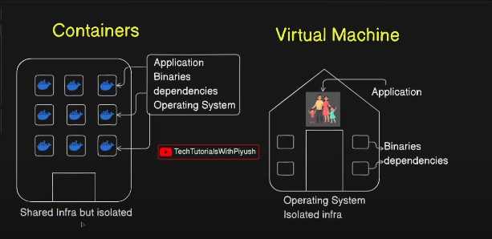
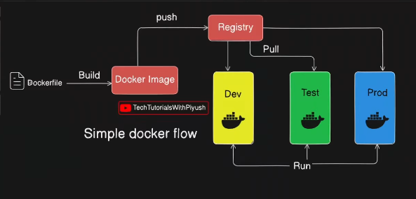
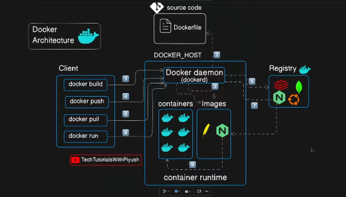

### Why we need containers

- Traditional Build flow


``` text
Most of the time the build failed in the production environemnt why because the mis-configurations in the different environment 
```

### Docker way to build flow






### Docker 

``` bash 
A platform that helps to execute these task build , ship  and our containers
```

### Container VS Virtual Machine 




<br>




``` bash

Virtualizartion 

It allows use to run mutiple OS instance concurrently in a single computer 

Virtual Machine :
    A software emulation of a physical machine which allows to multiple OS in a single machine and provide security and stability 

```

### Container 







``` bash 
Container are light weight and protable 
```


| **Aspect**       | **Docker (Containers)**                        | **Virtual Machines (VMs)**                |
| ---------------- | ---------------------------------------------- | ----------------------------------------- |
| **OS**           | Shares host OS kernel                          | Each VM has its own OS                    |
| **Boot Time**    | Starts in **seconds**                          | Starts in **minutes**                     |
| **Resource Use** | Lightweight (MBs)                              | Heavyweight (GBs)                         |
| **Performance**  | Near-native (low overhead)                     | Slower due to virtualization overhead     |
| **Isolation**    | Process-level isolation (less secure than VMs) | Strong isolation (hardware-level)         |
| **Use Case**     | Best for microservices & CICD pipelines       | Best for running multiple OS environments |


<br>


### Docker Flow



``` bash
Devlopers are responsible for creating the Dockerfile
What are the types od CMDS where used in the Dockerfile
```
``` bash

Dockerfile -> (build) -> Docker Imgae -> (run) -> Docker Conntainer ( Running Instance )
```

### Docker Architecture



# Docker Engine vs Docker Daemon

## Docker Engine
- Client–server application that powers Docker.
- Components:
  1. **Docker Daemon (`dockerd`)**
  2. **Docker REST API**
  3. **Docker CLI (`docker` command)**

## Docker Daemon
- Background service that manages:
  - Containers
  - 
  - Networks
  - Volumes
- Listens to Docker API requests and performs the actual operations.

---

## Flow Diagram

Docker CLI (`docker run nginx`)  
        ↓  
Docker REST API  
        ↓  
Docker Daemon (`dockerd`)  
        ↓  
Creates & runs **Container**

***
